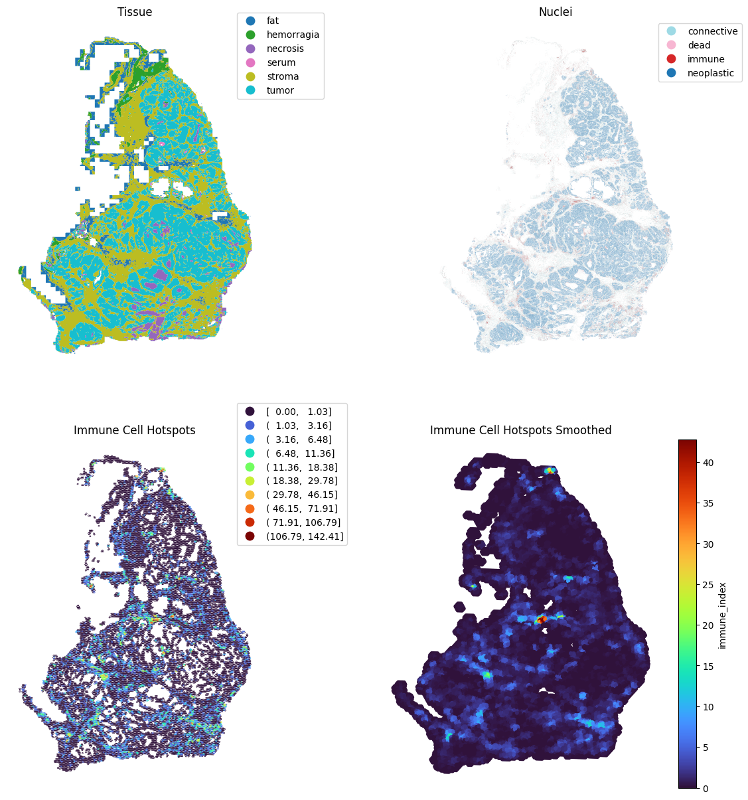

<div align="center">

# cellseg_gsontools

[](https://github.com/okunator/cellseg_models.pytorch/actions/workflows/tests.yml) [](https://github.com/okunator/cellseg_gsontools/blob/master/LICENSE) [](https://www.python.org/) [](https://pypi.org/project/cellseg-gsontools/)
[](https://zenodo.org/doi/10.5281/zenodo.10617987)


Tools for feature extraction in cell and tissue segmentation maps.

Checkout the [documentation](https://okunator.github.io/cellseg_gsontools/) for tutorials.

</div>

## Introduction

**Cellseg_gsontools** is a Python toolset designed to analyze and summarize large cell and tissue segmentation maps created from Whole Slide Images (WSI). The library is built on top of [`geopandas`](https://geopandas.org/en/stable/index.html) and [`libpysal`](https://pysal.org/libpysal/). In other words, the library can process **geospatial** data with **GeoJSON**-interface.


<p align="center">



</p>

**NOTE**: The library is synergetic with the [cellseg_models.pytorch](https://github.com/okunator/cellseg_models.pytorch) segmentation library which enables you to segment your WSI into `GeoJSON` format.

**Another NOTE**: The library expects that the cell type labels are in a field named `class_name` in your `geojson`. If not, you should rename that field to `class_name`.

## Installation

``` shell
pip install cellseg-gsontools
```

## Citation

```bibtex
@misc{cellseg_gsontools2023,
    title={{cellseg_gsontools}: Tools for feature extraction in cell and tissue segmentation maps.},
    author={Oskari Lehtonen},
    howpublished = {\url{https://github.com/okunator/cellseg_gsontools}},
    doi={https://zenodo.org/doi/10.5281/zenodo.10617987},
    year={2023}
}
```

## Contribute

Any suggestions, feature requests, or bug reports are welcome! Please open a new issue on GitHub for those. If you want to contribute to the codebase, please open a pull request.

## Licence

This project is distributed under [MIT License](https://github.com/okunator/cellseg_models.pytorch/blob/main/LICENSE)

If you find this library useful in your project, it is your responsibility to ensure you comply with the conditions of any dependent licenses. Please create an issue if you think something is missing regarding the licenses.
